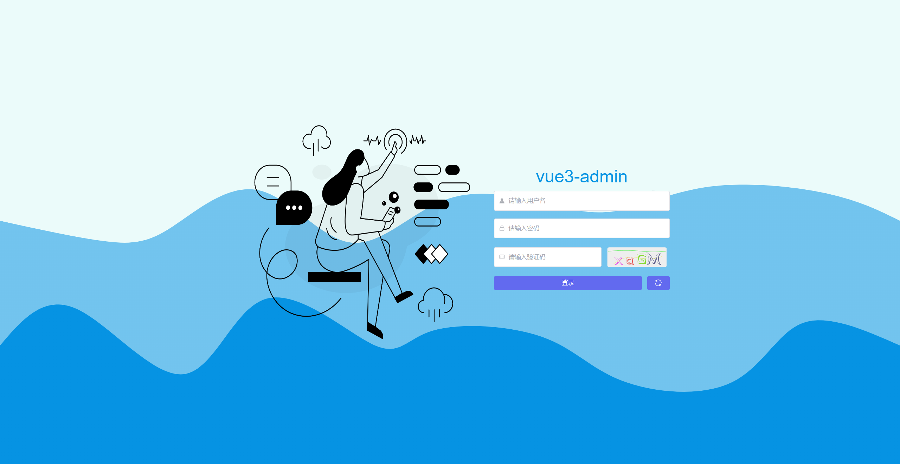
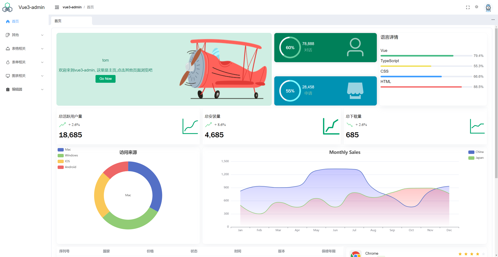
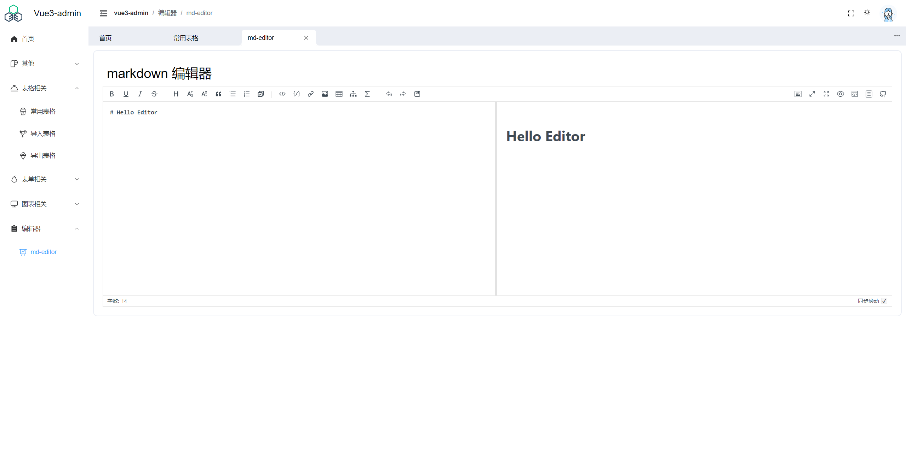
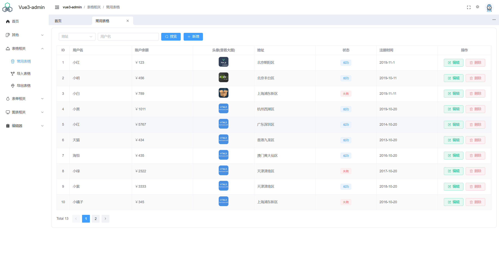

## 项目介绍

该项目是一个通用的 vue3-admin 模板，主要用于快速搭建一个基于 vue3 的通用后台管理系统。
前端基于 Vue3、Element-plus、Axios、Pinia，后端基于 NestJs、Prisma 搭建。

## 预览









## 部署

- 克隆项目

  git clone https://github.com/slince-zero/vue3-admin-fullstack.git

- 安装依赖

```
cd vue3-admin-main
npm install
cd vue3-admin-server
npm install
```

- 运行项目

准备一个名为 vue3-admin 的数据库

```
cd vue3-admin-main

npm run dev

cd vue3-admin-server

npx prisma migrate dev  // 这行代码是为了自动创建表到本地数据库当中

npm run start:dev
```

## 学习

这个项目很适合用来练手学习，也是我第一个较为完整的走通前后端的项目，写完这个项目之后，很多东西都逐渐变得清晰起来，当前这里面一定还存在一些问题，很多问题是通过 gpt 解决的。

以下是遇到的一些问题：

- nestjs 的身份验证 passport

首先解释一下 passport 和 jwt 的一个关系，

Passport 是最流行的 Node.js 身份验证库，广受社区认可，并在许多生产应用中成功使用。使用@nestjs/passport 模块，将这个库与 Nest 应用程序集成非常简单。
Passport 具有丰富的策略生态系统，实现了各种身份验证机制。
上面两端话来自于官方文档，passport 可以认为成一个小框架，这个小框架里面有很多策略（验证机制）一个就是 JWT 策略，另一个就是本地策略，还有一些其他的策略。

因此，这样看来，JWT 库是用于实现这些具体操作的工具，Passport 是用于实现这些具体操作的框架。


