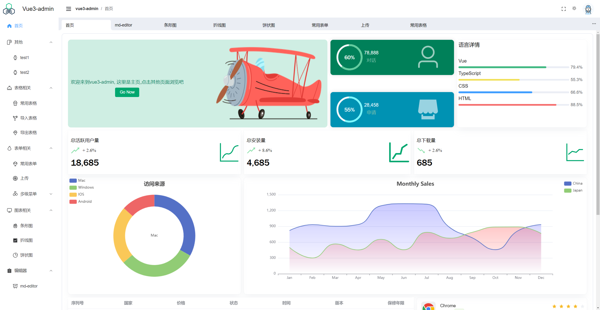
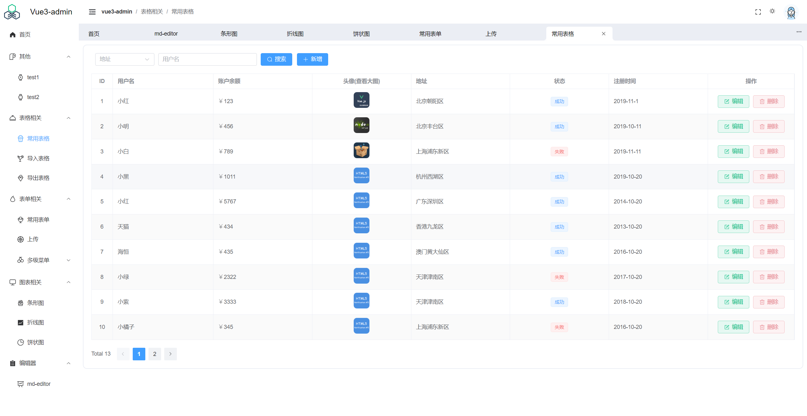
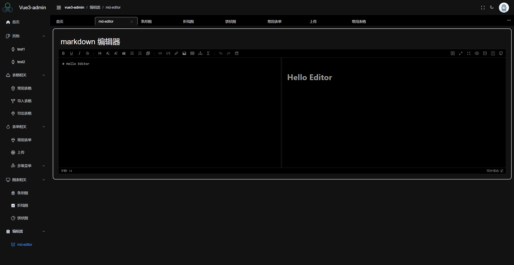

# vue3-admin

Vue3 Admin 是一个使用 Vue3，Pinia，Vue Router及 Element UI等技术构建的后台管理系统。
另外项目使用JS，学习成本很低，尽量标明了注释，非常适合小白练手学习。

## 展示

## 安装运行

    git clone https://github.com/slince-zero/Vue3-admin.git

    cd Vue3-admin

    npm install

    npm run dev

#### 注意

项目启动后默认跳转到登录界面，根据提示，输入任意值即可进入主页